# Kapitel 1

## Persona:
io  
tu  
lui / lei  
noi  
voi  
loro  

---
## Adverb für Städte:
essere di + Stadt  
abitare a + Stadt

---
## L'articolo indeterminativo

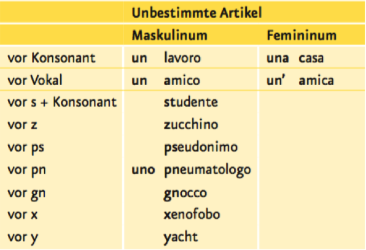

---
## Pronunciation
* piscina - pişina
* sciopero - şopero

---
## Conjugationen
| .         | lavorare   | vivere   | dormire   |
| --------- | ---------- | -------- | --------- |
| io        | lavor-o    | viv-o    | dorm-o    |
| tu        | lavor-i    | viv-i    | dorm-i    |
| lui / lei | lavor-a    | viv-e    | dorm-e    |
| noi       | lavor-iamo | viv-iamo | dorm-iamo |
| voi       | lavor-ate  | viv-ete  | dorm-ite  |
| loro      | lavor-ano  | viv-ono  | dorm-ono  |

---
## Reflexive Verben

| .         | .   |
| --------- | --- |
| io        | mi  |
| tu        | ti  |
| lui / lei | si  |
| noi       | ci  |
| voi       | vi  |
| loro      | si  |

* mi chiamo
* ti chiami

---
## Salutare in italiano

| .                       | .                                |
| ----------------------- | -------------------------------- |
| Guten Tag               | buongiorno/buon giorno           |
| Guten Abend             | buonasera/buona sera             |
| Gute Nacht              | buonanotte/buona notte           |
| Schönen Tag noch        | buona giornata                   |
| Schönen Abend noch      | buona serata                     |
| Schönen Nachmittag noch | buon pomeriggio                  |
| Schönes Wochenende      | buon fine settimana/buon weekend |

---
## Länder und Nationalitäten
* Francia - francese
* Germania - tedesco
* Spagna - Spagnolo
* America - Americano
* Inghilterra - Inglese
* Olanda - Olandese
* Italia - Italiano
* Turchia - Turco
* Potogallo - Portoghese
* Polonia - Polacco
* Russia - Russo
* Austria - Austriaco

---
## Prozente
* 10% - dieci per cento
* 10.5% - dieci virgola cinque per cento

---
## Perché
* Perché studi l'italiano?
* Studio l'italiano perché è una lingua musicale
* Studio l'italiano perché per parlare con la mia famiglia italiana
* Studio l'italiano perché per lavorare in Italia

---
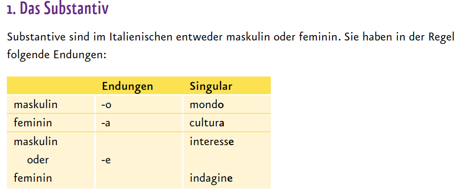

---
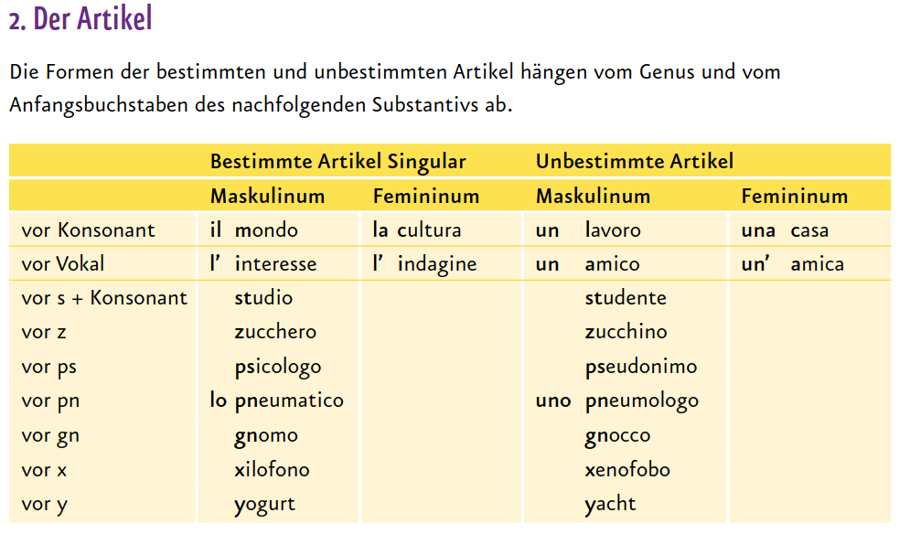

---

---

---

---
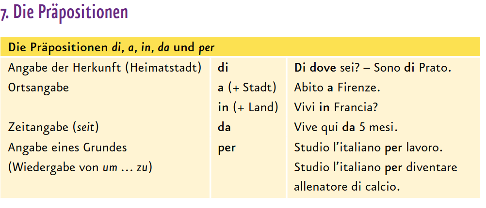

---

---

# Kapitel 2

## Wochentagen

| .         | .            |
| --------- | ------------ |
| monday    | il lunedì    |
| tuesday   | il martedi   |
| wednesday | il mercoledì |
| thursday  | il giovedi   |
| friday    | il venerdi   |
| saturday  | il sabato    |
| sunday    | la domenica  |

* a lunedì
* a il mercoledì

## Drinks / Snacks
bevande / spuntini

---
## Hunger / Thirst
Ho fame / Ho sete

---
## Verbi in -care e -gare-regola
| .         | pagare   | giocare   |
| --------- | -------- | --------- |
| io        | pago     | gioco     |
| tu        | paghi    | giochi    |
| lui / lei | paga     | gioca     |
| noi       | paghiamo | giochiamo |
| voi       | pagate   | giocate   |
| loro      | pagano   | giocano   |

-care -gare
* für tu und noi
* -> chi
* -> ghi

---
## Il Plurale delle parole in -ca/-ga & -co/-go-regola

Al femminile sempre:
* -ca -> -che
* -ga -> -ghe

Betonung auf der drittletzten Silbe:
* -co -> -ci
* -go -> -gi

Betonung auf der vorletzten Silbe:
* -co -> -chi
* -go -> -ghi

---
## Avverbi di frequenza

* di solito - usually
* qualche volta - sometimes
* a volte - sometimes
* sempre - always
* spesso - often
* raramente - rarely
* mai - never

Vor dem Verb:
* A volte ceno con amici

Nach dem Verb:
* Mangio sempre a casa

Negativ (vor dem Verb):
* Non bevo mai alcolici

---

---
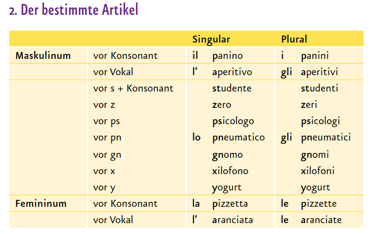

---

---
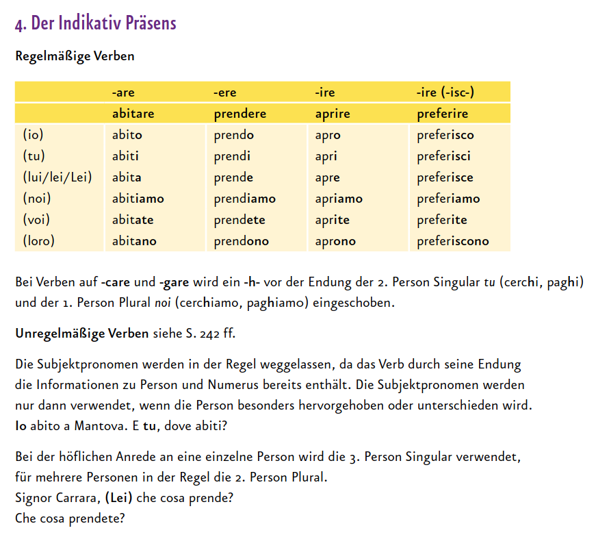

---

---

---
## L'articolo determinativo
| maschile                 | singolare | plurale |
| ------------------------ | --------- | ------- |
| davanti a consonante     | il        | i       |
| davanti a s + consonante | lo        | gli     |
| davanti a vocale         | l'        | gli     |

| femminile            | singolare | plurale |
| -------------------- | --------- | ------- |
| davanti a consonante | la        | le      |
| davanti a vocale     | l'        | le      |

---
## Le preposizioni articolate
| .   | il  | lo    | la    | i   | gli   | le    | l'    |
| --- | --- | ----- | ----- | --- | ----- | ----- | ----- |
| a   | al  | allo  | alla  | ai  | agli  | alle  | all'  |
| in  | nel | nello | nella | nei | negli | nelle | nell' |
| di  | del | dello | della | dei | degli | delle | dell' |
| da  | dal | dallo | dalla | dai | dagli | dalle | dall' |
| su  | sul | sullo | sulla | sui | sugli | sulle | sull' |

---
## piacere (passiv) / amare (aktiv) / adora (aktiv)
piacere Singular
* A Marco piace leggere libri

piacere Plural
* A te piacciono i reality show?

gli / agli
* Agli italiani piace guardere la tv.
* Gli italiani amano la buona cucina.

amare (aktiv)
* Maria ama studiare lingue

adora (aktiv)
* Nina adora fare sport

---
## betonten und unbetonten indirekten Objektpronomen
| .      | .   |
| ------ | --- |
| a me   | mi  |
| a te   | ti  |
| a lui  | gli |
| a lei  | le  |
| a noi  | ci  |
| a voi  | vi  |
| a loro | gli |

---
## Con und Senza
* con lo zucchero
* senza zucchero

---
## L'orario
* 05: e 5
* 10: e 10
* 15: e un quarto
* 20: e 20
* 25: e 25
* 30: e mezza
* 35: e 35
  
* 40: meno 20
* 45: meno un quarto
* 50: meno 10
* 55: meno 5

## A che ora?
* Alle due ho lezione.
* La biblioteca è aperta dalle 8:00 alle 20:00.

* a mezzogiorno
* all' una
* alle otto
* alle due

* da mezzogiorno all' una
* dall' una alle due
* dalle due alle tre

## vorrei
bei Verben
* io vorrei iscrivermi a questa universita

bei Nomen
* io vorrei anche alcune informazioni su questa universita

# Kapitel 3

## c'é und ci sono
es gibt ...

Singular
* In frigorifero c'é il latte.

Plural
* Le feste die Chiara ci sono sempre molto belle

---
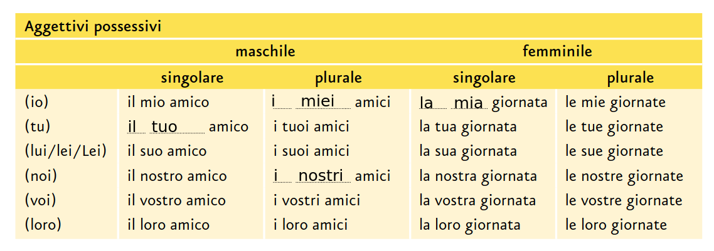

---
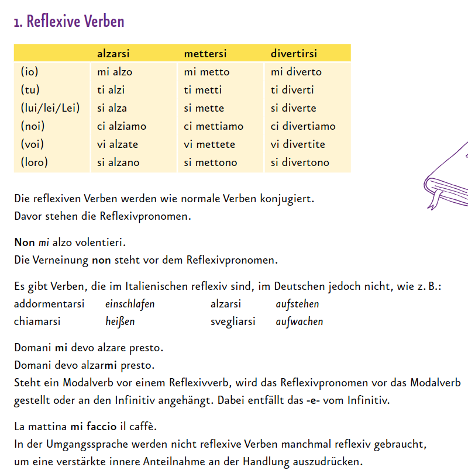

---
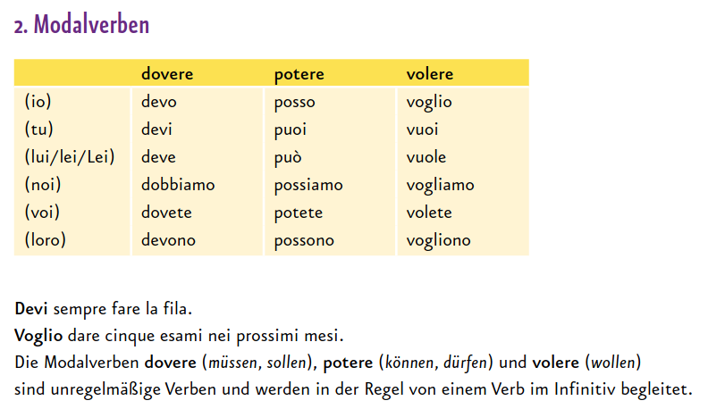

---
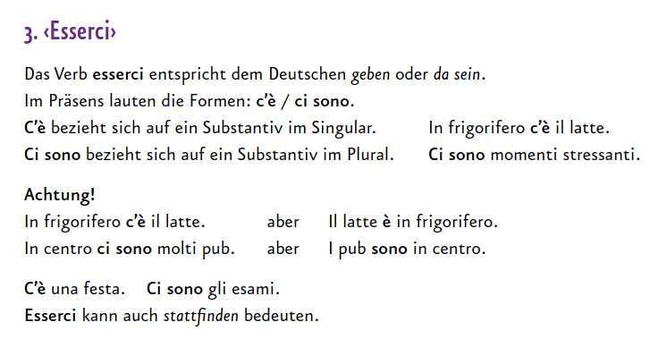

---
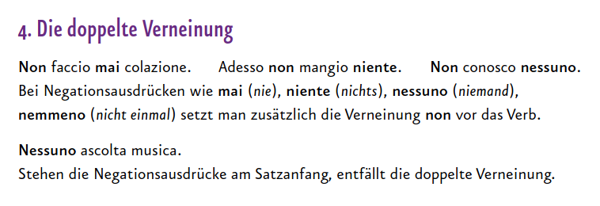

---
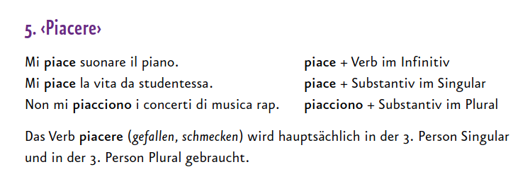

---
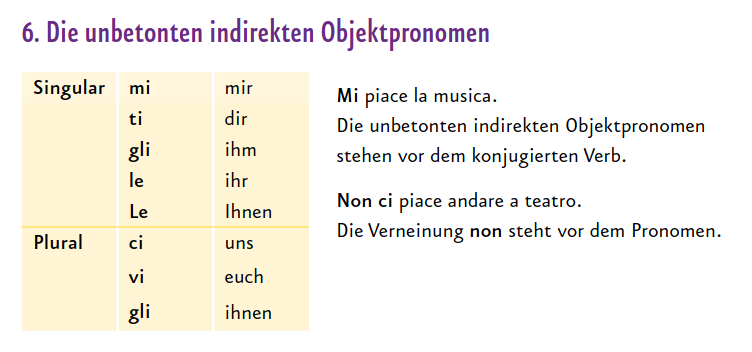

---

---
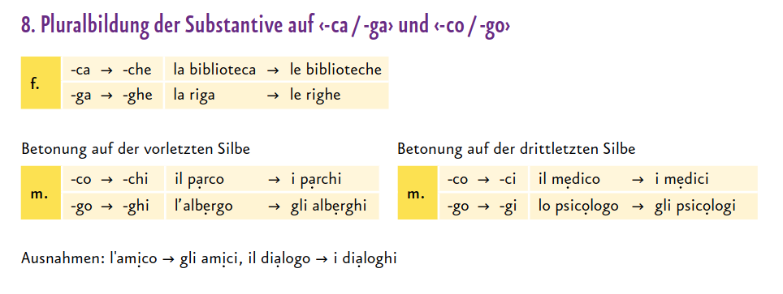

# Kapitel 4

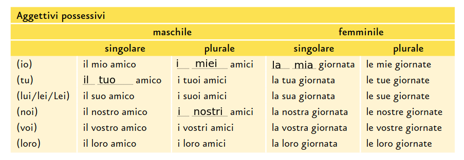

---
## Anche
* Anche a me.
* Neanche a me.

* A me invece no.
* A me invece si.

---
## Quantity
* moltissimo - very much,
* molto - very
* abbastanza - quite
* per niente - not at all